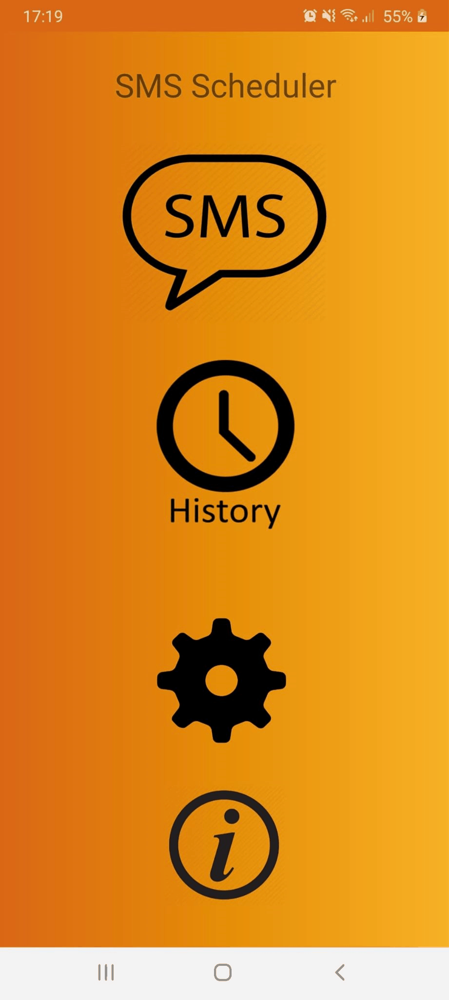

# SMS-Scheduler

# Purpose
This is a simple Android application that lets you read your contact list and send a message after a specific time. For example, if you want to deliver to someone a message after 8 hours, this application lets you do that in no time!

# Where I improved

• Java

• JUnit testing

• Android application development
